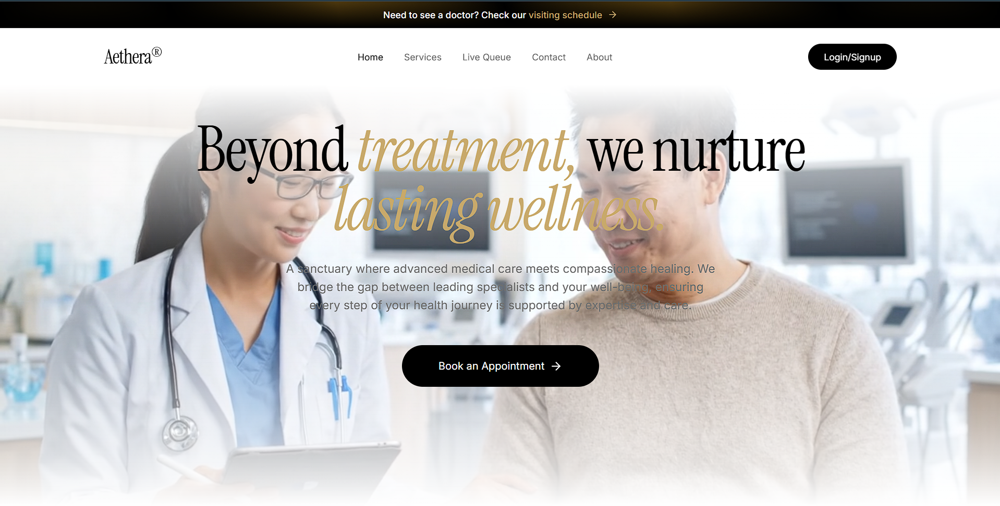
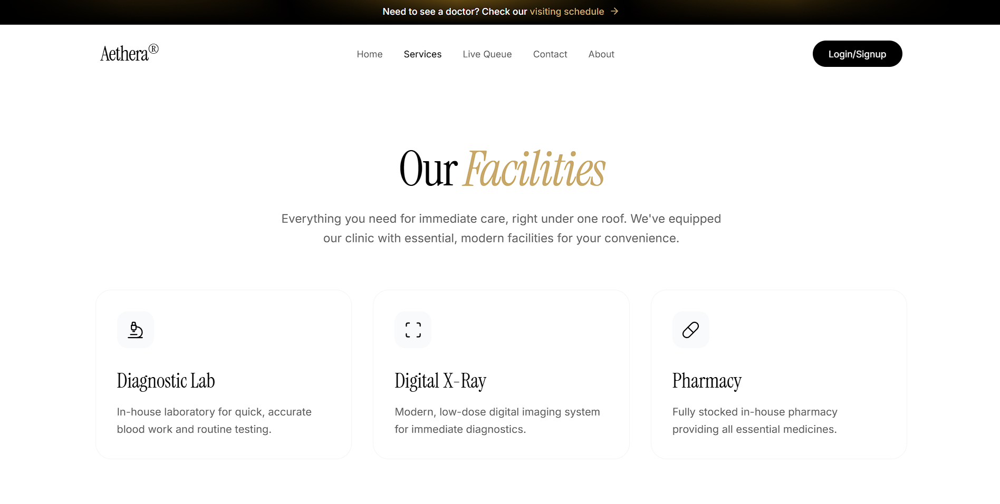
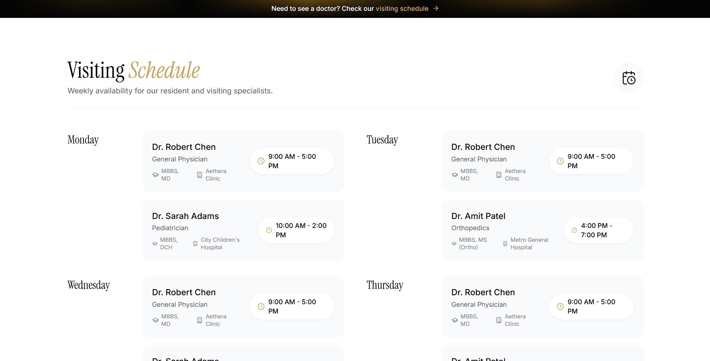
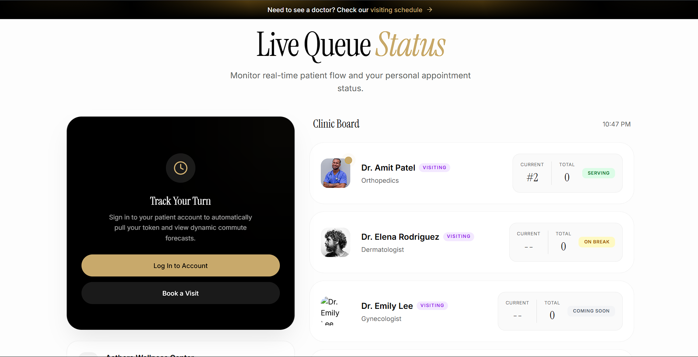
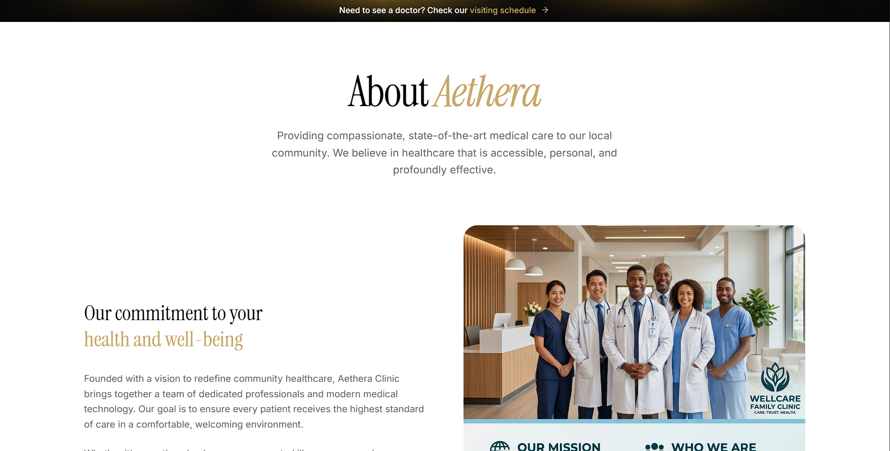
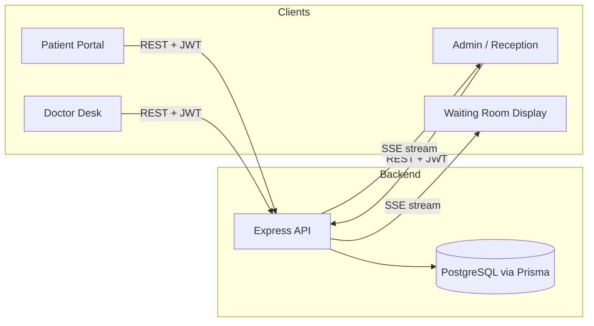

# Aethera — Clinic Management Suite

[](https://react.dev)
[](https://www.typescriptlang.org/)
[](https://nodejs.org)
[](https://www.postgresql.org)
[](#license)

A real-time clinic management platform with three role-scoped dashboards — patient booking, physician clinical desk, and admin reception — kept in sync across screens using Server-Sent Events. Built to replace the manual token-and-register workflow small clinics still run on.

**Live demo:** _add your deployed URL here once hosted_
**Demo video / GIF:** _add a 20–30s screen recording here — this matters more than any paragraph of description_

---

## Table of Contents
- [Screenshots](#screenshots)
- [Features](#features)
- [Architecture](#architecture)
- [Tech Stack](#tech-stack)
- [Project Structure](#project-structure)
- [Setup & Installation](#setup--installation)
- [Demo Accounts](#demo-accounts-development-only)
- [API Reference](#api-reference)
- [License](#license)

---

## Screenshots


### 🖥️ Landing & Services
| Home Page | Services & Facilities |
| :---: | :---: |
|  |  |

### 📅 Visiting Schedule


### ⏱️ Live Queue Status


### 🏥 About Aethera



---

## Features

**Patient Portal**
- Calendar-based booking across specialists (General Physician, Pediatrics, Orthopedics, Gynecology, Dermatology)
- Automatic token assignment per doctor per day
- Estimated wait-time calculation based on queue position

**Live Waiting-Room Display**
- Real-time "now serving" board driven by SSE, no polling
- Highlights the active token for visibility across the room

**Doctor's Clinical Desk**
- Per-doctor queue and patient history view
- Vitals capture (BP, temperature, pulse, SpO2)
- Structured prescription builder (medication, dosage, schedule, duration)
- Saving a consultation updates status and pushes an SSE event to reception/waiting-room clients

**Admin / Reception**
- Clinic profile and announcement management
- Split-pane prescription editor with print-ready preview
- Manual booking status overrides (Pending / Completed / Cancelled)

---

## Architecture

Three client roles talk to a single Express API over REST (JWT-authenticated). Booking and consultation writes are pushed out to subscribed clients over a Server-Sent Events channel, so the waiting-room board and reception screen update without a refresh.



**Why SSE instead of WebSockets:** updates are one-directional (server → client) — clients never need to push data back over the same channel — so SSE gives the real-time behavior needed here with a simpler connection model than a full WebSocket setup.

---

## Tech Stack

| Layer | Technology | Notes |
|---|---|---|
| Frontend | React 18, TypeScript, Vite | SPA with HMR |
| Styling | Tailwind CSS | |
| Backend | Node.js, Express, TypeScript | REST API |
| ORM | Prisma | Schema + migrations |
| Database | PostgreSQL | |
| Real-time | Server-Sent Events | Unidirectional event stream for queue/status updates |
| Validation | Zod | Request validation, frontend and backend |
| Auth | JWT | Role-based access (patient / doctor / admin) |

---

## Project Structure

```
├── server/                    # Express backend
│   ├── prisma/
│   │   ├── schema.prisma      # Database schema
│   │   └── seed.ts            # Seed script
│   ├── src/
│   │   ├── lib/
│   │   │   ├── prisma.ts      # Prisma client instance
│   │   │   └── sse.ts         # SSE broadcast manager
│   │   ├── middleware/
│   │   │   └── auth.ts        # JWT + role checks
│   │   ├── routes/
│   │   │   ├── auth.ts
│   │   │   ├── bookings.ts
│   │   │   ├── doctors.ts
│   │   │   ├── queue.ts
│   │   │   └── settings.ts
│   │   └── index.ts
│   └── package.json
│
└── src/                       # React frontend
    ├── components/
    ├── lib/
    │   └── api.ts              # Axios client config
    ├── pages/
    │   ├── admin/               # Dashboard, Bookings, Doctors, Availability, Settings
    │   ├── doctor/               # Dashboard (vitals + Rx writer)
    │   ├── Booking.tsx
    │   ├── LiveQueue.tsx
    │   ├── Login.tsx / Signup.tsx
    │   └── Home.tsx / About.tsx / Contact.tsx
    └── App.tsx
```

---

## Setup & Installation

**Prerequisites:** Node.js v16+, a running PostgreSQL instance.

### 1. Backend

```bash
cd server
```

Create `server/.env`:

```
PORT=5000
DATABASE_URL="postgresql://<user>:<password>@127.0.0.1:5432/aethera?schema=public"
JWT_SECRET="<generate-a-random-secret-do-not-reuse-this-example>"
```

```bash
npm install
npx prisma db push
npm run prisma:seed
npm run dev
```

Server runs on `http://localhost:5000`.

### 2. Frontend

```bash
npm install
npm run dev
```

App runs on `http://localhost:5173`.

---

## Demo Accounts (development only)

> ⚠️ These accounts exist only in the seeded local/demo database for evaluation purposes. They are never used in a real deployment, and the passwords below are intentionally simple placeholders — replace `JWT_SECRET` and all credentials before deploying anywhere public.

| Role | Email | Password | Access |
|---|---|---|---|
| Admin | `admin@aethera.com` | `adminpassword` | Full reception dashboard, token overrides, prescription printing |
| Doctor | `doctor@aethera.com` | `doctorpassword` | Vitals, case notes, Rx formulator (seeded as Dr. Robert Chen) |
| Patient | `patient@aethera.com` | `patientpassword` | Booking + personal appointment dashboard |

---

## API Reference

All routes are prefixed with `/api`. Protected routes require `Authorization: Bearer <token>`.

**Auth**
- `POST /auth/signup` — create account
- `POST /auth/login` — authenticate, returns JWT + role
- `GET /auth/me` — current user profile *(protected)*

**Bookings**
- `GET /bookings` — all bookings *(admin)*
- `GET /bookings/my` — caller's bookings *(protected)*
- `GET /bookings/doctor` — bookings assigned to caller *(doctor)*
- `POST /bookings` — create a booking *(protected)*
- `PUT /bookings/:id/status` — override status *(admin)*
- `PUT /bookings/:id/prescription` — save vitals + Rx *(doctor)*
- `POST /bookings/:id/cancel` — cancel own booking *(protected)*

**Queue**
- `GET /queue/sse` — SSE stream for live wait-list updates
- `GET /queue/status` — current serving token + totals

**Settings**
- `GET /settings` — clinic profile
- `PUT /settings` — update clinic profile *(admin)*

---

## License

MIT — see [LICENSE](LICENSE) for details.

---

Built by [Karthik Ajay](https://github.com/karthikajay04).